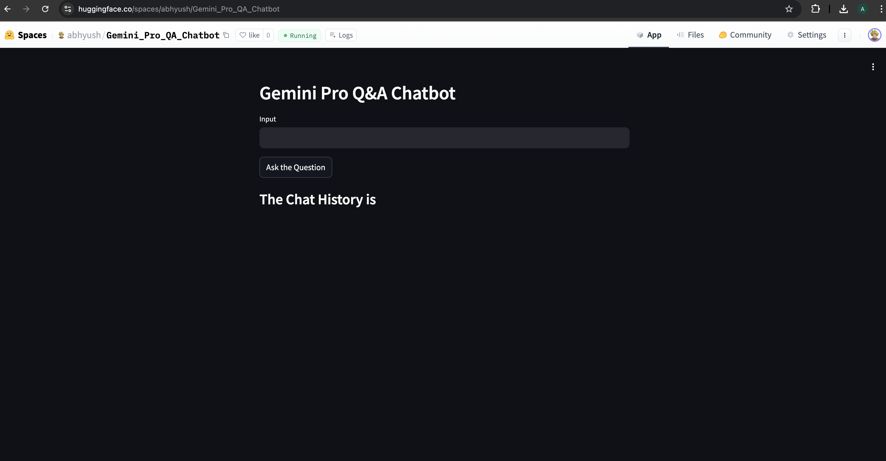

# Gemini LLM Application with Streamlit

This project demonstrates the use of Google's **Gemini Pro** language model for an interactive Q&A application. Built with **Streamlit**, the app allows users to ask questions, receive responses, and maintain a chat history. The **Gemini Pro** model processes user queries and provides intelligent, conversational responses.

---

## 📖 Table of Contents
- [Overview](#overview)
- [Features](#features)
- [Requirements](#requirements)
- [Installation](#installation)
- [Methodology](#methodology)
- [Image Preview](#image-preview)
- [References](#references)

---

## 🌟 Overview
The application enables users to interact with Google's **Gemini Pro** large language model for real-time Q&A. It utilizes the `google.generativeai` Python library to load the model and generate responses. 

---

## ✨ Features
- **Gemini Pro Integration**: Uses the Gemini Pro model for natural language understanding and generation.
- **Streamlit UI**: Provides a user-friendly interface for queries and responses.
- **Chat History**: Maintains a record of user interactions for context-aware conversations.
- **Streaming Responses**: Displays streamed chunks of the model's responses in real-time.

---

## 🛠 Requirements
- Python 3.x
- Streamlit
- google-generativeai
- python-dotenv

---

## 🧠 Methodology
### Key Steps:
1. **Gemini Model Initialization**:
   - The app loads the Gemini Pro model using an API key stored in a `.env` file.
   - A chat instance is created for conversational responses.

2. **Streamlit Interface**:
   - A user interface is built to accept questions via text input.
   - Responses are displayed in real-time, chunk by chunk.

3. **Chat History**:
   - User queries and model responses are stored in session state.
   - Chat history is displayed at the bottom of the app for context.

4. **Dynamic Response Handling**:
   - Gemini Pro generates responses in a streaming fashion for a seamless user experience.

---

## 🖼 Image Preview

---

## 🔍 References
- [Streamlit Documentation](https://docs.streamlit.io/)
- [Google Generative AI Documentation](https://developers.generativeai.google/)
- [Gemini Pro Model Overview](https://ai.google/)

---

## 📌 Author
Feel free to contribute or open an issue for improvements!
